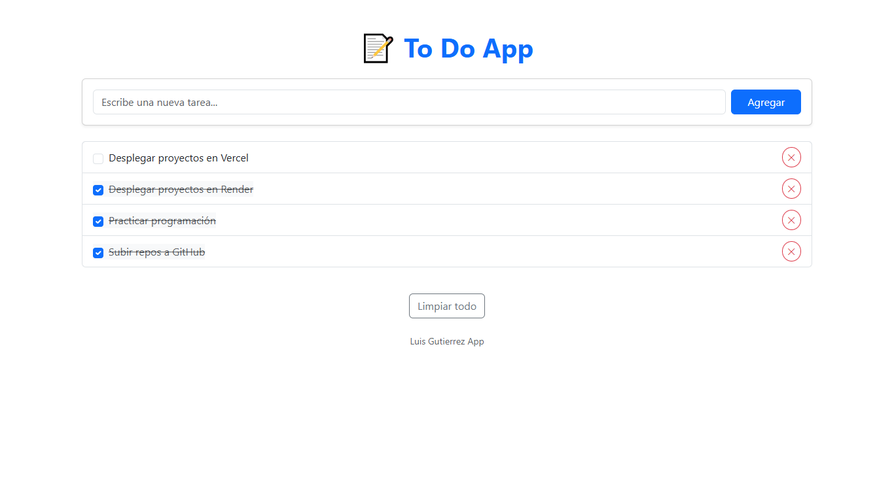
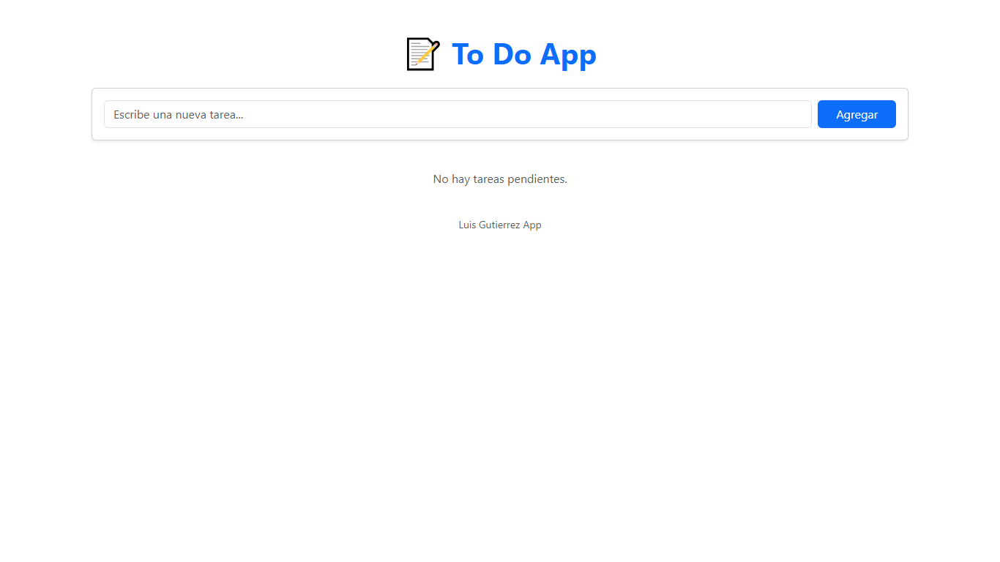
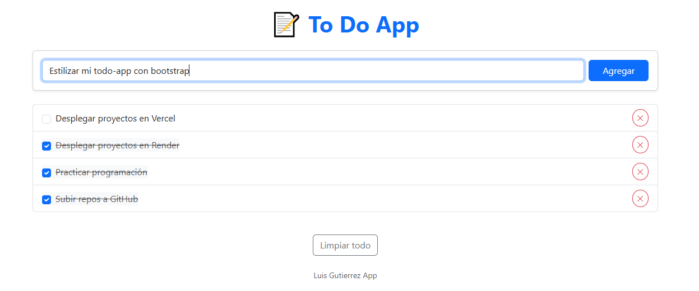
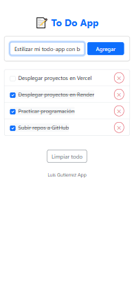

# To-Do App

Aplicación fullstack simple para gestionar tareas. Incluye un frontend en React con comunicación a un backend en Express, utilizando una base de datos en MongoDB Atlas.

## 🏷️ Badges


---

## Tecnologías utilizadas

### **Frontend**

- React (funcional, usando Hooks)
- Fetch API para la comunicación con el backend
- Bootstrap para los estilos
- Componentes principales:

  - `App.jsx`
  - `TaskForm.jsx`
  - `TaskItem.jsx`

- Servicio:

  - `services/task.js`

### **Backend**

- Node.js + Express
- MongoDB Atlas como base de datos
- Mongoose para modelos y validación
- Estructura del backends: rutas, controladores, modelos, middlewares básicos

## Funcionalidades

### Implementadas

- Crear tareas
- Listar tareas
- Marcar tareas como completadas
- Eliminar tareas
- Persistencia en base de datos

### No implementadas (pendientes)

- Autenticación de usuarios
- Pruebas en frontend y backend (unitarias, integración y e2e)
- Loader para interacciones async
- Filtros de tareas (completadas, pendientes, etc.)
- Mejoras de UI/UX
- Manejo de errores más robusto en frontend y backend

## Estructura del proyecto

```
todo-app/
├── backend/
│   ├── controllers/
│   ├── models/
│   ├── utils/
│   ├── app.js
│   ├── index.js
│   └── .env (no incluido)
└── frontend/
    ├── src/
    │   ├── components/
    │   │   ├── TaskForm.jsx
    │   │   └── TaskItem.jsx
    │   ├── services/
    │   │   └── task.js
    │   └── App.jsx
    ├── index.html
    └── package.json
```

## 📸 Capturas

### Dashboard principal




### Agregar tarea



### Vista móvil



---

## ⚙️ Instalación y ejecución local

### 🔹 1. Clonar el repositorio

```bash
git clone https://github.com/luisgutierrez11/todo-app.git
cd agenda-contacts
```

### 🔹 2. Instalar dependencias

Frontend:

```
cd frontend
npm install
```

Backend:

```
cd backend
npm install
```

---

## API del backend

### **GET /api/tasks**

Obtiene todas las tareas.

### **POST /api/tasks**

Crea una nueva tarea. Body esperado:

```json
{
  "title": "Texto de la tarea"
}
```

### **PUT /api/tasks/:id**

Actualiza una tarea (por ejemplo, cambiar estado `completed`).

### **DELETE /api/tasks/:id**

## Elimina una tarea.

## Mejoras futuras

- Implementar autenticación con JWT
- Agregar tests con Vitest en frontend y Jest/Supertest en backend
- Filtros y búsqueda de tareas
- Mejor diseño visual
- Loader y manejo de errores en UI
- Optimizar servicio para backend (posibles custom hooks)

---

## Estado del proyecto

Proyecto finalizado en su versión base. Pendiente de mejoras.

## 📜 Licencia

Este proyecto está bajo la licencia MIT — ver el archivo LICENSE para más detalles.

## 👨‍💻 Autor

Luis Gutiérrez
Desarrollador web fullstack

```
    📧 luis.gut.11jm@gmail.com
    🌐 https://github.com/luisgutierrez11
```
